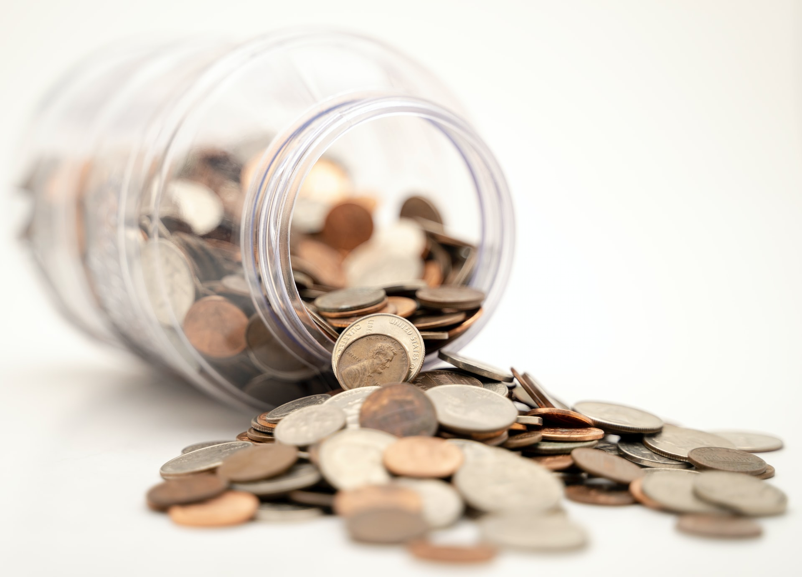
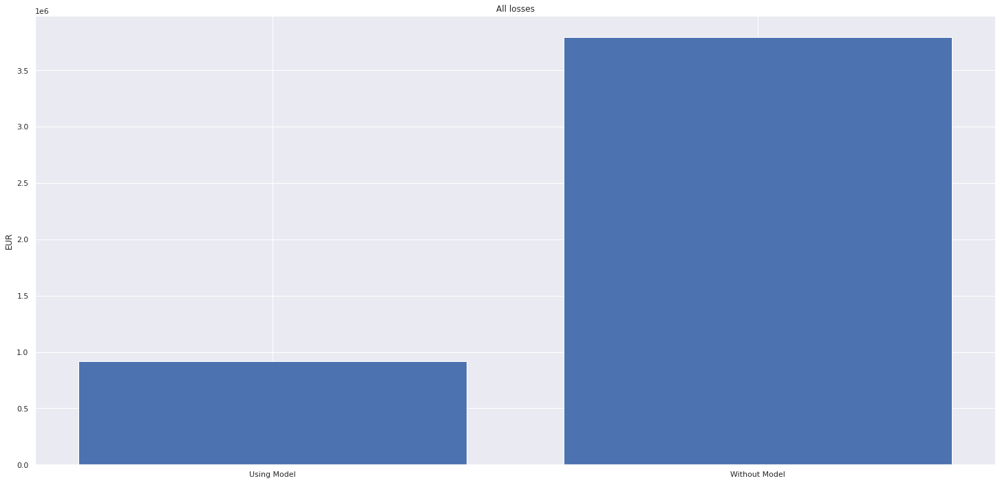

# Client Churn Predict

It is a data science project with a focus on predicting whether a customer will be churn or not. This term is used to refer to customers who find themselves evaded.

    

 

## Contexto

>The following context is completely fictional. All information was taken from the Data Science project proposal on the website [Seja um Data scientist](https://sejaumdatascientist.com/predicao-de-churn/).

TopBank is a large banking services company. It operates mainly in European countries offering financial products, from bank accounts to investments, including some types of insurance and investment products. The company's business model is a service type, that is, it sells banking services to its customers through physical branches and an online portal. The company's main product is a bank account, in which the customer can deposit his salary, make withdrawals, deposits and transfer to other accounts. This bank account has no cost to the customer and is valid for 12 months, that is, the customer needs to renew the contract of that account to continue using it for the next 12 months.

According to the TopBank Analytics team, each customer who has this bank account returns a monetary value of 15% of the value of their estimated salary, if it is less than the average and 20% if this salary is higher than the average, during the current period of your account. This value is calculated annually. For example, if a customer's monthly salary is R$ 1,000.00 and the average of all bank wages is R$ 800. The company, therefore, invoices R $ 200 annually with this client. If this customer has been in the bank for 10 years, the company has already earned R $ 2,000.00 from its transactions and account usage.

In recent months, the Analytics team realized that the rate of customers canceling their accounts and leaving the bank, reached unprecedented numbers in the company. Concerned about the increase in this rate, the team devised an action plan to reduce the rate of customer evasion. Concerned, TopBank's Analytics team hired you as a Data Science consultant to create an action plan, with the objective of reducing customer evasion, that is, preventing the customer from canceling his contract and not renewing it for another 12 months. This evasion, in business metrics, is known as Churn.

In general, Churn is a metric that indicates the number of customers who have canceled the contract or have stopped buying your product within a certain period of time. For example, customers who canceled the service contract or after it expired, did not renew it, they are considered churn customers. Another example would be customers who have not made a purchase for more than 60 days. These customers can be considered churn customers until a purchase is made. The 60-day period is completely arbitrary and varies between companies.

### The Challenge

As a Data Science Consultant, you need to create an action plan to decrease the number of churn customers and show the financial return on your solution.

At the end of your consultancy, you need to deliver to the TopBottom CEO a model in production, which will receive a customer base via API and return that same base “scored”, that is, one more column with the probability of each customer entering into churn.

In addition, you will need to provide a report of the performance of your model and the financial impact of your solution. Questions that the CEO and the Analytics team would like to see in their report:

1. What is TopBank's current Churn rate? How does it vary monthly?
1. Qual a Performance do modelo em classificar os clientes como churns?
1. What is the expected return, in terms of revenue, if the company uses its model to avoid churn from customers?

A possible action to prevent the customer from churning is to offer a discount coupon, or some other financial incentive for him to renew his contract for another 12 months.

Which customers would you give the financial incentive to and what would that amount be, in order to maximize ROI (Return on Investment). Recalling that the sum of the incentives for each client cannot exceed EUR 10,000.00.

### About the data

The data used to make the TopBank Data Science project was taken from the competition website [Kaggle](https://www.kaggle.com). To access the original data use the [link](https://www.kaggle.com/mervetorkan/churndataset).

Each row represents a customer and each column contains some attributes that describe that customer. The data set includes information about

* **RowNumber:** O número da coluna
* **CustomerID:** Identificador único do cliente
* **Surname:** Sobrenome do cliente.
* **CreditScore:** A pontuação de Crédito do cliente para o mercado de consumo.
* **Geography:** O país onde o cliente reside.
* **Gender:** O gênero do cliente.
* **Age:** A idade do cliente.
* **Tenure:** Número de anos que o cliente permaneceu ativo.
* **Balance:** Valor monetário que o cliente tem em sua conta bancária.
* **NumOfProducts:** O número de produtos comprado pelo cliente.
* **HasCrCard:** Indica se o cliente possui ou não cartão de crédito.
* **IsActiveMember:** Indica se o cliente fez pelo menos uma movimentação na conta bancário dentro de 12 meses.
* **EstimateSalary:** Estimativa do salário mensal do cliente.
* **Exited:** Indica se o cliente está ou não em Churn.

## Methodology

This project will be based on Cross-industry standard process for data mining (CRISP-DM). A standard idea about data science project may be linear: data preparation, modeling, evaluation and deployment. However, when we use CRISP-DM methodology a data science project become circle-like form. Even when it ends in Deployment, the project can restart again by Business Understanding. How might it help? It may help to avoid the data scietist to stop in one specific step and wast time on it. When all the project is completed the data scientist can return to initial step and do every step again. Therefore, the main goal it is to follow circles as it needs.

    

## Results

### Model Results

Some models have been tested to obtain the best model for this project. The best results found were from the SVC which is based on the Support Vector Machine (SVM). The model was also fine tuned to achieve better parameters than the standards, so it was possible to slightly improve the metrics. Now the results of the model were shown in single performance (train and valid) and corss validation performance (the entire database is used to train and test the model). For a final assessment of the model, it was used to predict "unseen" data and assess its scores.

#### Single Result

| Balanced Accuracy   | Precision | Recall | F1     | Kappa |
| ------------------- | --------- | ------ | ------ | ----- |
| 0.769               | 0.433     | 0.809  | 0.564  | 0.407 |

#### Cross Validation

| Balanced Accuracy   | Precision       | Recall          | F1              | Kappa           |
| ------------------- | --------------- | --------------- | --------------- | --------------- |
| 0.755 +/- 0.011     | 0.433 +/- 0.021 | 0.753 +/- 0.007 | 0.558 +/- 0.017 | 0.405 +/- 0.026 |

#### Unseen Data

| Balanced Accuracy   | Precision | Recall | F1     | Kappa |
| ------------------- | --------- | ------ | ------ | ----- |
| 0.767               | 0.459     | 0.765  | 0.574  | 0.428 |

## Business Questions

*  ### What is currently the TopBank's annual churn rate?

    The annual churn rate is 20.30%.

* ### How does the chunr rate vary monthly? 

    The bank's monthly churn rate is 4.5%.

* ### What is the expected return, in terms of revenue, if the company uses its model to avoid churn from customers?

    For the test base, 2878197.97 recovered from 3795019.60.
Approximately 0.76% of recovered losses.

* ### What is the churn rate using the model?

    The churn rate will be of 0.24%.

## References

* [Be a Data Scientist](https://sejaumdatascientist.com/)

* [Churn Dataset](https://www.kaggle.com/mervetorkan/churndataset)

* [Image Reference](https://unsplash.com/photos/lhltMGdohc8)

* [CRISP-DM Image](https://en.wikipedia.org/wiki/Cross-industry_standard_process_for_data_mining)

## License

This project is licensed under the MIT License - see the [LICENSE](LICENSE) file for details